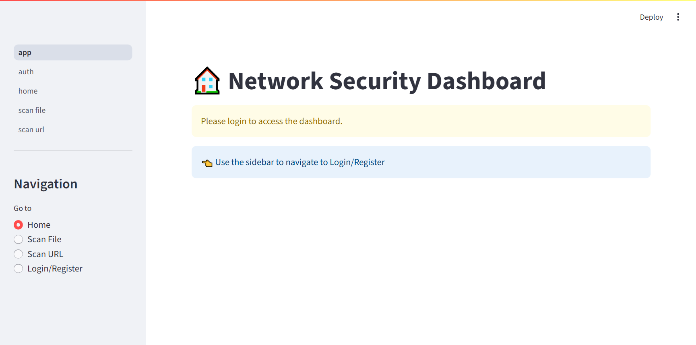
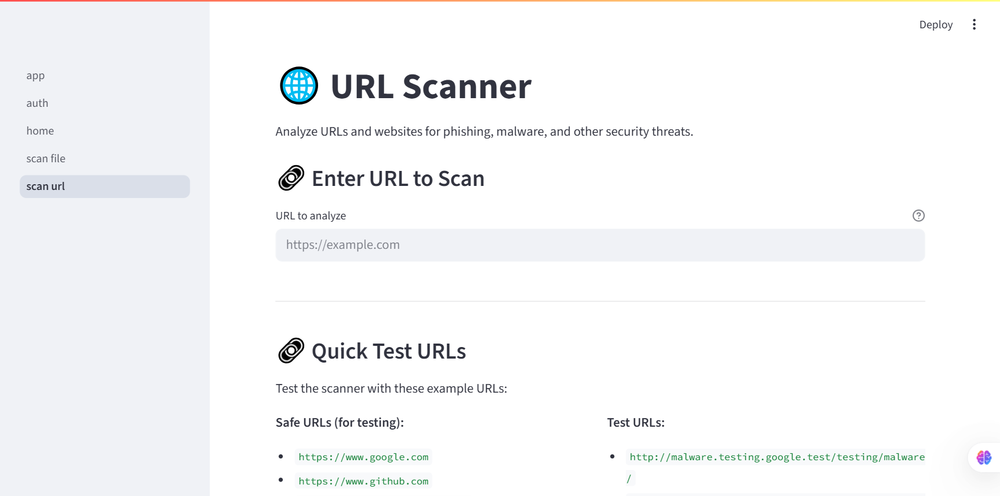
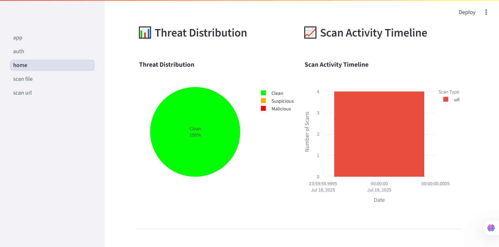
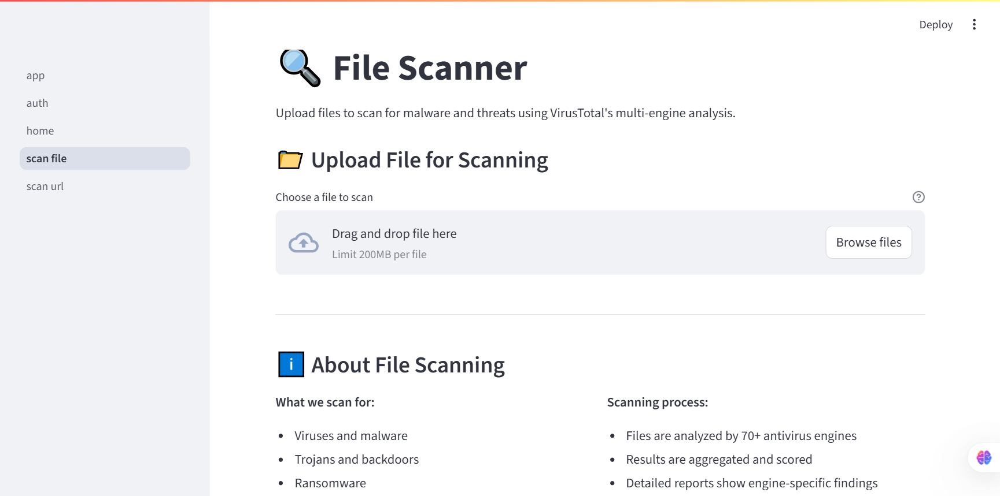
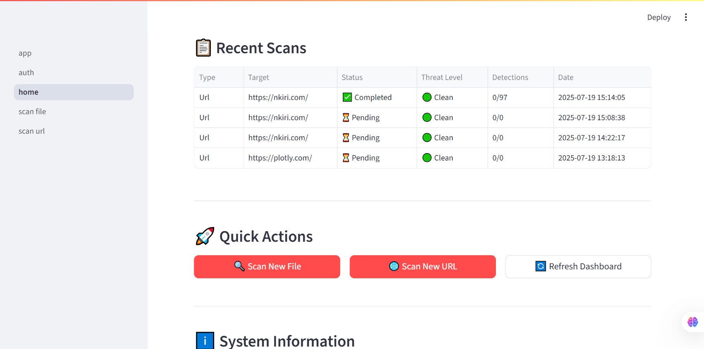
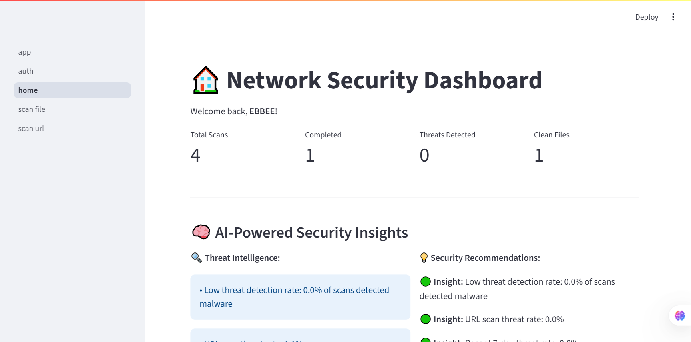

# 🛡️ Network Security Platform



## Overview

The **Network Security Platform** is a modern, machine learning-powered web application designed to help users scan files and URLs for potential threats using the VirusTotal API. Built with Streamlit, it offers an intuitive interface, user authentication, scan history, and interactive visualizations to empower individuals and organizations to protect their digital assets.

---

## ✨ Features

- **File & URL Scanning**: Analyze files and URLs for malware and threats using VirusTotal.
- **User Authentication**: Secure login and registration system.
- **Scan History**: Track and review previous scans.
- **Interactive Visualizations**: View scan results and threat metrics with dynamic charts.
- **Machine Learning Integration**: Leverages ML models for enhanced threat detection (see PDF for design details).
- **Database Storage**: All scan data is stored in a local SQLite database.
- **Responsive UI**: Built with Streamlit for fast, cross-platform access.

---

## 📸 Application Screenshots

### Login & Registration


### Home Dashboard


### File Scan Page


### URL Scan Page


### Scan Results Visualization


### Threat Metrics


---

## 🧠 Design & Machine Learning Implementation

> **Reference: Design and Implementation of Machine Learning for Network Security.pdf**

The platform integrates machine learning models to enhance threat detection and analysis. The design includes:

- **Data Collection**: Files and URLs are submitted by users and analyzed via VirusTotal.
- **Feature Extraction**: Relevant features are extracted from scan results and metadata.
- **ML Model Training**: Models are trained on labeled datasets to classify threats and predict risk levels.
- **Prediction & Visualization**: Results are presented with interactive charts and metrics for user interpretation.

**Architecture Highlights:**
- Modular codebase (`utils/`, `pages/`, `models/`)
- Secure user management
- Scalable for future ML model integration
- Visual analytics for actionable insights

---

## 🚀 Quick Start

### 1. **Clone the Repository**
```bash
# Download the project files
```

### 2. **Setup Python Environment**
- Python 3.7+
- Create and activate a virtual environment:

```powershell
python -m venv venv
venv\Scripts\activate
```

### 3. **Install Dependencies**
```bash
pip install -r requirements.txt
```

### 4. **Configure Environment Variables**
- Copy `.env.example` to `.env`
- Add your VirusTotal API key:

```env
VIRUSTOTAL_API_KEY=your_actual_api_key_here
```

### 5. **Run the Application**
```bash
streamlit run app.py
```

- Access at [http://localhost:8501](http://localhost:8501)

---

## 🗂️ Project Structure

```
network-security-platform/
├── app.py
├── requirements.txt
├── .env.example
├── pages/
│   ├── __init__.py
│   ├── auth.py
│   ├── home.py
│   ├── scan_file.py
│   └── scan_url.py
├── utils/
│   ├── auth_utils.py
│   ├── db_utils.py
│   ├── ml_utils.py
│   ├── scan.py
│   ├── user.py
│   ├── virustotal_api.py
│   └── visualization_utils.py
├── models/
├── static/
│   └── css/
├── data/
│   └── app.db
├── visual/
│   └── [screenshots]
```

---

## 🛠️ Setup & Troubleshooting

See [Setup Guide - Network Security Platform.md](Setup%20Guide%20-%20Network%20Security%20Platform.md) for:
- System requirements
- Installation steps
- API key setup
- Common issues & solutions
- Advanced configuration
- Security considerations

---

## 📊 Performance & Security

- **Performance**: Lightweight, fast scans, optimized for low resource usage.
- **Security**: User authentication, API key protection, secure data storage.
- **Data Privacy**: Files sent to VirusTotal; do not upload confidential files.

---

## 📚 References

- **Design and Implementation of Machine Learning for Network Security.pdf**
- **Setup Guide - Network Security Platform.md**
- [VirusTotal API Documentation](https://developers.virustotal.com/reference)
- [Streamlit Documentation](https://docs.streamlit.io/)

---

## 🤝 Contributing

Contributions are welcome! Please open issues or submit pull requests for improvements.

---

## 📧 Support

For help, see the Setup Guide or open an issue in this repository.

---

## 🏆 Success Indicators
- Application starts without errors
- Web interface loads at localhost:8501
- Can create and login to user account
- Can scan files and URLs
- Database file appears in `data/`

---

## License

This project is for educational and research purposes.
